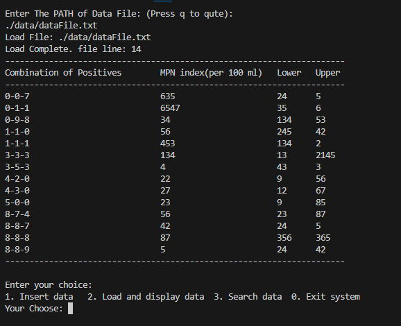

# CPP FILE OPERATIONS

## 来自厦门大学的软件工程专业的一道 C++ 文件操作题

数据文件 `bin\data\dataFile.txt` 的格式在手动写入时务必遵守每行 `#-#-# ## ## ##` 的格式，不然会造成读取错误或者无法读取。

数据文件的格式示例如下所示：

5-0-0 23 9 85  
4-3-0 27 12 67  
4-2-0 22 9 56  
4-2-1 26 12 65  
4-3-1 33 15 77  
4-4-0 34 16 80  
3-3-3 45 3 87  
1-6-7 98 67 09  

## 2024.1.20 考虑重构成完全面向对象的架构，充分使用 C++ 的特性

## 2023.1.21 目前已经完成了 增，查，还要主函数逻辑的重构，相较于主分支的结构更加合理，此外还增加了一个简易的终端颜色库，根据输出日志的等级不同调整颜色

### 运行截图

Latest Updat Date: 2024.01.24

Author: JesseZ332623

Licence: [GNU AFFERO GENERAL PUBLIC LICENSE v.3.0](https://www.gnu.org/licenses/agpl-3.0.en.html)
