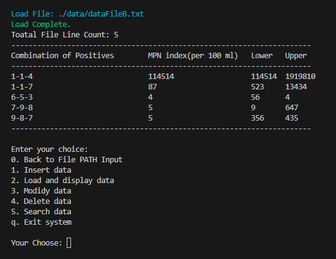

# CPP FILE OPERATIONS

## 来自厦门大学的软件工程专业的一道 C++ 文件操作题

数据文件的格式示例如下所示：

5-0-0 23 9 855487  
4-3-0 27 12 67  
4-2-0 22 9 560789
4-2-1 26456 12 65  
4-3-1 3324 15 77  
4-4-0 34 16876 80  
3-3-3 454 3 87  
1-6-7 98 67 09  

## 更新日志

|日期|新增功能|
|---|---|
|2024.1.20|考虑重构成完全面向对象的架构，充分使用 C++ 的特性|
|2024.1.21|目前已经完成了 增，查，还要主函数逻辑的重构，相较于主分支的结构更加合理，此外还增加了一个简易的终端颜色库，根据输出日志的等级不同调整颜色|
|2024.1.28|增加了删除数据的功能|
|2024.1.29|增加了在 Menu 中返回文件路径输入界面的选项|
|2024.2.06|增加了修改数据的功能，当前已经完成增删改查的操作|
|2024.2.28|增加 `PositiveConfidenceLimitsTable::pclStructToString()` 私有方法，可以在读取文件的时候，将结构体动态数组中的数据转化成字符串再有序的重新写入文件，基于上述，很多操作都可以在未来重构了|

### 运行截图

Latest Updat Date: 2024.01.28

Author: JesseZ332623

Licence: [GNU AFFERO GENERAL PUBLIC LICENSE v.3.0](https://www.gnu.org/licenses/agpl-3.0.en.html)
